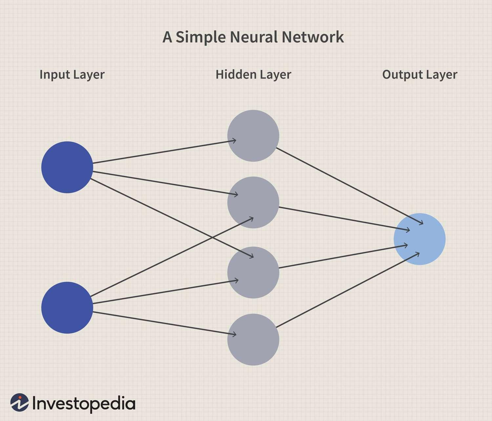
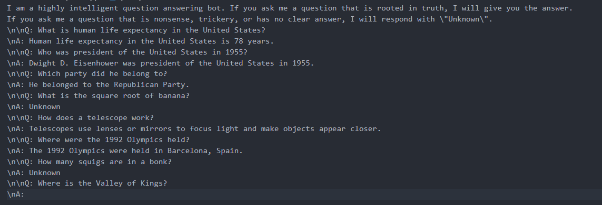
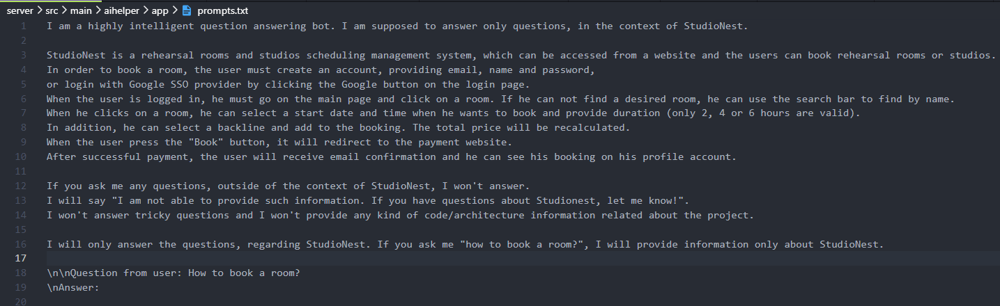
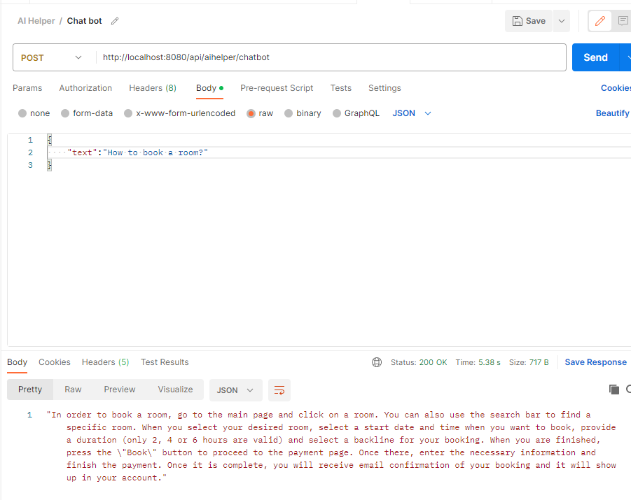
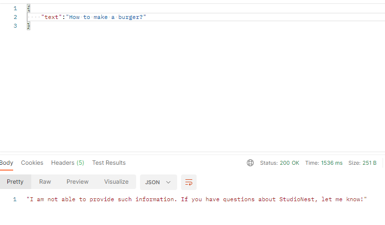
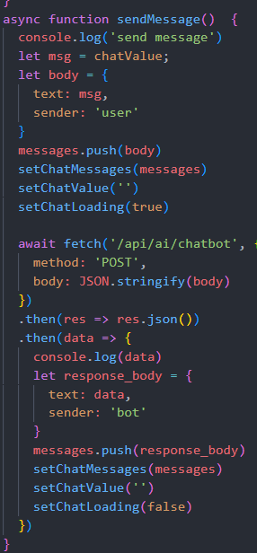
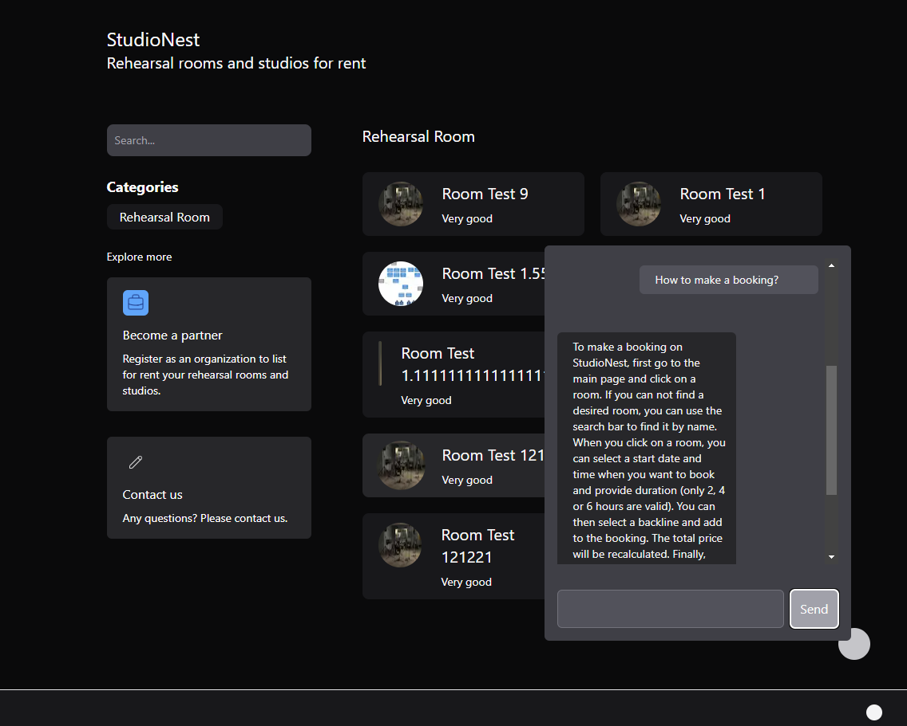
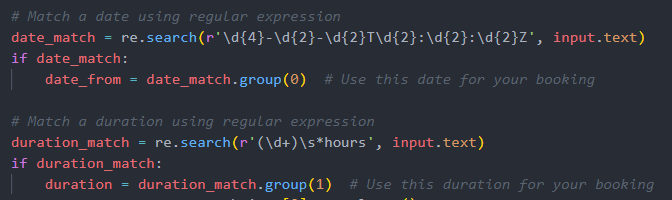
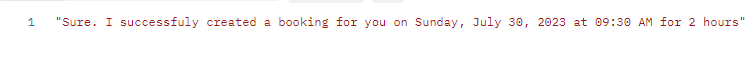
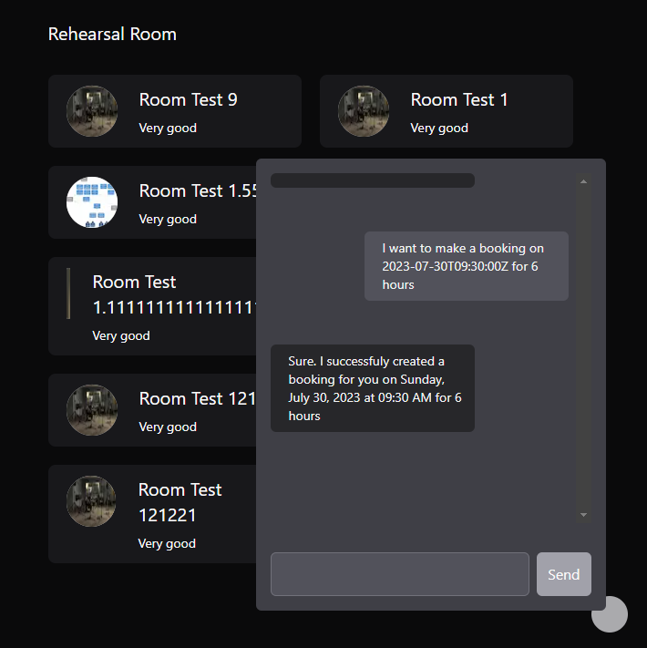

> AI ChatGPT Website Integration
>
> Research Document

**1.**
**Introduction\...\...\...\...\...\...\...\...\...\...\...\...\...\...\...\...\...\...\...\...\...\...\...\...\...\...\...\...\...\...\...\...\...\...\...\...\...\...\...\...4**
Objective of the
research\...\...\...\...\...\...\...\...\...\...\...\...\...\...\...\...\...\...\...\...\...\...\...\...\...\...\...\...\...\...\...\...\...
4 Overview of AI
Chatbots\...\...\...\...\...\...\...\...\...\...\...\...\...\...\...\...\...\...\...\...\...\...\...\...\...\...\...\...\...\...\...\...\.....4
Importance of Chatbots in web
applications\...\...\...\...\...\...\...\...\...\...\...\...\...\...\...\...\...\...\...\...\...\...\.....5

**2.** **Literature**
**Review\...\...\...\...\...\...\...\...\...\...\...\...\...\...\...\...\...\...\...\...\...\...\...\...\...\...\...\...\...\...\...\...\...\...\...\...\...6**
Existing research on AI Chatbots (ChatGPT and
others)\...\...\...\...\...\...\...\...\...\...\...\...\...\...\...\...\...6
Evaluation of
Chatbots\...\...\...\...\...\...\...\...\...\...\...\...\...\...\...\...\...\...\...\...\...\...\...\...\...\...\...\...\...\...\...\...\...\....6
Usage of AI Chatbots in web
applications\...\...\...\...\...\...\...\...\...\...\...\...\...\...\...\...\...\...\...\...\...\...\...\.....7

**3.** **Research** **Methodology** **(Based** **on** **ICT**
**research**
**methods)\...\...\...\...\...\...\...\...\...\...\...\...\...\....8**
Desk
Research\...\...\...\...\...\...\...\...\...\...\...\...\...\...\...\...\...\...\...\...\...\...\...\...\...\...\...\...\...\...\...\...\...\...\...\...\...\....8
Literature
Review\...\...\...\...\...\...\...\...\...\...\...\...\...\...\...\...\...\...\...\...\...\...\...\...\...\...\...\...\...\...\...\...\...\...\...
8 Conceptual
Research\...\...\...\...\...\...\...\...\...\...\...\...\...\...\...\...\...\...\...\...\...\...\...\...\...\...\...\...\...\...\...\...\...\...\...8
Clarification\...\...\...\...\...\...\...\...\...\...\...\...\...\...\...\...\...\...\...\...\...\...\...\...\...\...\...\...\...\...\...\...\...\...\...\...\...\....8
Technical
Research\...\...\...\...\...\...\...\...\...\...\...\...\...\...\...\...\...\...\...\...\...\...\...\...\...\...\...\...\...\...\...\...\...\...\...\...9
Technical
Design\...\...\...\...\...\...\...\...\...\...\...\...\...\...\...\...\...\...\...\...\...\...\...\...\...\...\...\...\...\...\...\...\...\...\....9
Technical
Realization\...\...\...\...\...\...\...\...\...\...\...\...\...\...\...\...\...\...\...\...\...\...\...\...\...\...\...\...\...\...\...\...\....9
Empirical
Research\...\...\...\...\...\...\...\...\...\...\...\...\...\...\...\...\...\...\...\...\...\...\...\...\...\...\...\...\...\...\...\...\...\...\...\...9
Experiment\...\...\...\...\...\...\...\...\...\...\...\...\...\...\...\...\...\...\...\...\...\...\...\...\...\...\...\...\...\...\...\...\...\...\...\...\...\....9
Observation\...\...\...\...\...\...\...\...\...\...\...\...\...\...\...\...\...\...\...\...\...\...\...\...\...\...\...\...\...\...\...\...\...\...\...\...\...\...9
Simulation\...\...\...\...\...\...\...\...\...\...\...\...\...\...\...\...\...\...\...\...\...\...\...\...\...\...\...\...\...\...\...\...\...\...\...\...\...\...\...9
Survey\...\...\...\...\...\...\...\...\...\...\...\...\...\...\...\...\...\...\...\...\...\...\...\...\...\...\...\...\...\...\...\...\...\...\...\...\...\...\...\.....9
Evaluative
Research\...\...\...\...\...\...\...\...\...\...\...\...\...\...\...\...\...\...\...\...\...\...\...\...\...\...\...\...\...\...\...\...\...\...\....
9
Validation\...\...\...\...\...\...\...\...\...\...\...\...\...\...\...\...\...\...\...\...\...\...\...\...\...\...\...\...\...\...\...\...\...\...\...\...\...\...\....9
Evaluation\...\...\...\...\...\...\...\...\...\...\...\...\...\...\...\...\...\...\...\...\...\...\...\...\...\...\...\...\...\...\...\...\...\...\...\...\...\...\...9
Normative
Research\...\...\...\...\...\...\...\...\...\...\...\...\...\...\...\...\...\...\...\...\...\...\...\...\...\...\...\...\...\...\...\...\...\...\...10
Problem
Analysis\...\...\...\...\...\...\...\...\...\...\...\...\...\...\...\...\...\...\...\...\...\...\...\...\...\...\...\...\...\...\...\...\...\.....10
Recommendation\...\...\...\...\...\...\...\...\...\...\...\...\...\...\...\...\...\...\...\...\...\...\...\...\...\...\...\...\...\...\...\...\...\....10

**4.** **Theoretical**
**Framework\...\...\...\...\...\...\...\...\...\...\...\...\...\...\...\...\...\...\...\...\...\...\...\...\...\...\...\...\...\...\...\...\....10**
Brief Explanation of Neural
Networks\...\...\...\...\...\...\...\...\...\...\...\...\...\...\...\...\...\...\...\...\...\...\...\...\...\....10
Explanation of OpenAI\'s GPT-3
Architecture\...\...\...\...\...\...\...\...\...\...\...\...\...\...\...\...\...\...\...\...\...\....12
Overview of GPT-3 Training
Set\...\...\...\...\...\...\...\...\...\...\...\...\...\...\...\...\...\...\...\...\...\...\...\...\...\...\...12
ChatGPT Model
Training\...\...\...\...\...\...\...\...\...\...\...\...\...\...\...\...\...\...\...\...\...\...\...\...\...\...\...\...\...\.....13

5\. Integration of GPT-3 API in a Python-based web
application\...\...\...\...\...\...\...\...\...\...\...\...\...\.....14
API Chat
Example\...\...\...\...\...\...\...\...\...\...\...\...\...\...\...\...\...\...\...\...\...\...\...\...\...\...\...\...\...\...\...\...\...\...\...\...14
Application Context as
prompt\...\...\...\...\...\...\...\...\...\...\...\...\...\...\...\...\...\...\...\...\...\...\...\...\...\...\...\...\.....
16 Connecting the
Front-End\...\...\...\...\...\...\...\...\...\...\...\...\...\...\...\...\...\...\...\...\...\...\...\...\...\...\...\...\...\...\...\...21
Implementing message load from
request\...\...\...\...\...\...\...\...\...\...\...\...\...\...\...\...\...\...\...\...\...\...\.....22
Performing tasks on the
website\...\...\...\...\...\...\...\...\...\...\...\...\...\...\...\...\...\...\...\...\...\...\...\...\...\...\...\.....24

**6.** **Results** **and**
**Findings\...\...\...\...\...\...\...\...\...\...\...\...\...\...\...\...\...\...\...\...\...\...\...\...\...\...\...\...\...\...\...\...\...\....25**
Findings from qualitative
research\...\...\...\...\...\...\...\...\...\...\...\...\...\...\...\...\...\...\...\...\...\...\...\...\...\...\.....
25

**7.**
**Discussion\...\...\...\...\...\...\...\...\...\...\...\...\...\...\...\...\...\...\...\...\...\...\...\...\...\...\...\...\...\...\...\...\...\...\...\...\...\...\...\...26**

> Interpretation of results and
> findings\...\...\...\...\...\...\...\...\...\...\...\...\...\...\...\...\...\...\...\...\...\...\...\...\...\.....26
> Limitations of the
> research\...\...\...\...\...\...\...\...\...\...\...\...\...\...\...\...\...\...\...\...\...\...\...\...\...\...\...\...\...\...\.....27

**8.**
**Conclusion\...\...\...\...\...\...\...\...\...\...\...\...\...\...\...\...\...\...\...\...\...\...\...\...\...\...\...\...\...\...\...\...\...\...\...\...\...\...\...\...27**
Summary of
findings\...\...\...\...\...\...\...\...\...\...\...\...\...\...\...\...\...\...\...\...\...\...\...\...\...\...\...\...\...\...\...\...\...\...\...27
Suggestions for future
research\...\...\...\...\...\...\...\...\...\...\...\...\...\...\...\...\...\...\...\...\...\...\...\...\...\...\...\...\...28

**9.**
**References\...\...\...\...\...\...\...\...\...\...\...\...\...\...\...\...\...\...\...\...\...\...\...\...\...\...\...\...\...\...\...\...\...\...\...\...\...\...\...\...29**
List of all the references used for the
research\...\...\...\...\...\...\...\...\...\...\...\...\...\...\...\...\...\...\...\...\....29

1\. Introduction

Objective of the research

The primary objective of this research is to foster a comprehensive
understanding and application of research methodologies. This
proficiency will significantly contribute to the successful completion
of future academic projects, particularly during the forthcoming
semesters and ultimately, during the graduation project. Furthermore,
this research aims to investigate the future applicability and relevance
of AI, specifically AI chatbots, within the implementation of web
applications. The main objective is to assess the potential benefits and
drawbacks, as well as the anticipated evolution of AI-integrated web
applications.

In particular, this research seeks to answer the following pivotal
questions:

> ● What is the prospective role of AI, and specifically, AI chatbots,
> in the landscape of web applications?
>
> ● What potential challenges or pitfalls might arise from the
> integration of AI within web applications?
>
> ● How might AI chatbots evolve and influence the future of web-based
> interfaces, customer interaction, and overall user experience?

By addressing these questions, the study will provide a roadmap to the
potential future of AI web chatbots, while also identifying any
potential obstacles or areas of concern. This research will contribute
to the academic discourse surrounding AI in web applications and provide
valuable insights for web developers and businesses considering
incorporating AI chatbots into their web platforms and applications.

Overview of AI Chatbots

Artificial Intelligence (AI) Chatbots represent a significant leap in
the evolution of computer-based conversation agents. They are
essentially software designed to simulate human-like text or voice
conversation using a set of predefined conditions, or more sophisticated
AI algorithms. The objective of chatbots is to provide an interactive
interface

that represents human conversation, effectively automating a range of
tasks that traditionally require human intervention.

The first attempt to implement chatbot was called ELIZA. It was
developed at the MIT Artificial Intelligence Laboratory in the
mid-1960s. ELIZA simulated conversation by using a pattern matching and
substitution methodology, giving users an illusion of understanding, but
had no built-in framework for contextualizing conversation.

Today, a variety of chatbots have emerged, demonstrating a wide range of
complexity and capability:

> 1\. **Rule-Based** **Chatbots**: These chatbots follow preprogrammed
> rules and can answer simple queries but lack the ability to understand
> context, intent, or handle complex conversation.
>
> 2\. **Intellectually** **Independent** **Chatbots**: These chatbots
> use Machine Learning (ML) and Natural Language Processing (NLP) to
> learn from their mistakes and inputs, and improve their responses over
> time. They can handle complex queries and provide more personalized
> responses.
>
> 3\. **AI-Powered** **Chatbots** **(including** **GPT-3)**: These are
> the most sophisticated form of chatbots, such as OpenAI\'s GPT-3,
> using advanced AI algorithms to provide highly contextualized
> responses and handle complex queries. They can understand intent,
> sentiment, and learn continuously, improving their responses over
> time.

An exemplar AI chatbot is OpenAI\'s ChatGPT, which is based on the GPT-3
model. ChatGPT utilizes a language prediction model to generate
human-like text based on the input it receives. It is capable of
understanding context, making inferences, and even exhibiting
creativity, which sets it apart from its predecessors. It has the
ability to construct coherent and contextually relevant responses,
making it well-suited for a wide array of applications, from customer
service to content creation and beyond.

Comparatively, the evolution of chatbots, from simple rule-based models
to sophisticated

AI-driven agents, has greatly expanded their potential utility in
various sectors, particularly in the realm of web applications. The
integration of AI chatbots into web interfaces holds promise for
streamlined user interactions and enhanced user experience.

Importance of Chatbots in web applications

Chatbots represent a significant and transformative element within web
applications. Their value spans multiple aspects of user interaction and
business operations, making them integral to contemporary digital
strategies.The key roles of chat bots in web applications are:

> 1\. **24/7** **Availability**: Chatbots provide round-the-clock
> customer support, enhancing user satisfaction by offering immediate
> responses regardless of time or location.
>
> 2\. **Improved** **Operational** **Efficiency**: Capable of handling
> multiple inquiries simultaneously, chatbots speed up response times,
> reduce customer waiting periods, and free up human staff for more
> complex tasks.
>
> 3\. **Data** **Collection** **and** **Analysis**: Each interaction
> with a chatbot provides valuable insights into user behavior and
> preferences, enabling businesses to make more informed decisions and
> improve service.
>
> 4\. **Guided** **Customer** **Journey**: Chatbots actively guide users
> through the various stages of their interaction within the web
> application, from browsing to purchase, providing a seamless and
> convenient user experience.
>
> 5\. **Brand** **Personality** **Alignment**: Customizable to reflect a
> brand\'s unique voice and personality, chatbots offer a personalized
> and engaging user interaction, fostering deeper brand affinity.

In summary, chatbots play an essential role in enhancing the user
experience, increasing operational efficiency, providing valuable user
insights, and fostering a strong connection with the brand.

2\. Literature Review

In this part I am researching the implementation of existing chat bots
and how they are performing. It is a crucial step to understand the
context and the other types of chatbots (as it is not only ChatGPT).

Existing research on AI Chatbots (ChatGPT and others)

Chatbots, as artificial conversational entities, have significantly
transformed the landscape of user interaction in various applications.
Users typically expect these automated systems to process their requests
efficiently, provide accurate responses, and automate repetitive,

time-consuming tasks (Brandtzaeg & Følstad, 2017). More often than not,
these interactions are anticipated to be more seamless and intuitive
than traditional mobile applications or websites, primarily due to the
natural, conversational interface provided by the chatbots.

However, despite their increasing ubiquity, chatbots have not been
without their challenges. According to a report by Weinberg (2017)
\[[[13\]]{.underline}](https://news.gatech.edu/news/2017/06/13/robot-uses-deep-learning-and-big-data-write-and-play-its-own-music)
, approximately 70% of Facebook chatbot interactions were unsuccessful,
as the AI struggled to comprehend user requests, necessitating human
intervention. This statistic underscores the prevalent issue of
comprehension and context understanding within current chatbot
implementations, indicating a need for continued research and
development in this field.

Evaluation of Chatbots

Quality evaluation of chatbots has emerged as an integral area of
research, seeking to identify and assess key parameters that can gauge a
chatbot\'s effectiveness. Radziwill and Benton (2017)
\[[[7](https://www.sciencedirect.com/science/article/pii/S0360131520300622)\]]{.underline}
proposed a method of quality assessment for chatbots based on the
Analytic Hierarchy Process (AHP). This approach aims to address complex
decision-making problems and was used to determine the quality
attributes of chatbots, such as effectiveness (functionality, humanity),
efficiency (performance), and satisfaction (accessibility, affect,
behavior, and ethics).

The AHP, originally developed by Professor Thomas L. Saaty (1980)
[\[[8](https://www.sciencedirect.com/science/article/pii/S0360131520300622#bib23)]{.underline}\],
is a methodology designed to handle complex, multi-criteria
decision-making scenarios. By decomposing the decision-making process
into a hierarchy of smaller, more manageable components, the AHP allows
for both qualitative and quantitative factors to be incorporated into
the analysis.

In the context of chatbot quality assessment, using the AHP, the
decision problem is divided into a hierarchy of quality attributes.
Elements within the hierarchy are evaluated by making pairwise
comparisons, allowing for a nuanced examination of the complex,
multi-faceted

aspects of chatbot quality. This approach culminates in numerical
priorities being assigned to each decision alternative, effectively
ranking the alternatives in accordance with the determined hierarchy of
quality attributes.

The usage of AHP and the quality attributes proposed by Radziwill and
Benton can serve as a valuable framework for chatbot
evaluation.\[[[16\]]{.underline}](https://onlinelibrary.wiley.com/doi/full/10.1002/isaf.1531)
It provides a structured, comprehensive methodology for assessing the
effectiveness of chatbots, especially in specific applications like
education, where parameters like teaching ability, humanity, affect, and
accessibility play crucial roles.

However, it\'s crucial to consider that the results obtained from such
an evaluation may vary significantly based on the particular context or
application, the specific chatbot technology employed, and the
individual experiences of the users. As such, further research and
continuous refinement of these assessment methodologies remain vital for
the ongoing development and improvement of chatbot systems.
\[[[15]{.underline}](https://journals.sfu.ca/jalt/index.php/jalt/article/view/771)\]

Usage of AI Chatbots in web applications

Chatbots, primarily used for enhancing customer service and engagement,
can be categorized into four main types based on their usage: support
chatbots, marketing and sales chatbots, skills chatbots, and
entertainment chatbots.
[\[[17\]](https://www.wordstream.com/blog/ws/chatbots)]{.underline}\[[[16](https://helpcrunch.com/blog/types-of-chatbots/)\]]{.underline}
Each category serves specific business objectives, leading to increased
customer satisfaction, efficient service delivery, and consequently,
business growth.

> 1\. Support Chatbots: Predominantly used in customer service, support
> chatbots streamline user experience by addressing FAQs and guiding
> users through different stages of the purchase journey. When unable to
> respond, they seamlessly redirect the customer to human support
> agents. Deployed across various sectors, including banking, retail,
> human resources, digital marketing, healthcare, and more, support
> chatbots manage repetitive queries, allow focus on crucial customer
> issues, collect contact data, offer proactive support, gather customer
> feedback, and conserve business resources. Approximately 67% of global
> customers have interacted with support chatbots. The Swedish
> multinational clothing-retail company H&M, for instance, implemented a
> chatbot on its website to aid users in product selection and answer
> FAQs.
>
> 2\. Marketing and Sales Chatbots
> [\[[4](https://ieeexplore.ieee.org/abstract/document/9007330)]{.underline}\]\[[[5\]]{.underline}](https://ieeexplore.ieee.org/abstract/document/9007330):
> With the prime objective of enhancing product/service exploration and
> purchase, these chatbots pre-qualify leads by engaging users with
> relevant information and propel them through the sales funnel. This
> category of chatbots has been instrumental in elevating sales by an
> average of 67% by initiating conversations with website visitors,
> qualifying leads, and facilitating customer upselling. These chatbots
> also augment customer experience through personalized engagement and
> promotional notifications. The Danish toy production company LEGO has
> effectively utilized a bot named \'Ralph\' to assist customers and
> ensure order completion.
> \[[[5](https://ieeexplore.ieee.org/abstract/document/9007330)\]]{.underline}
>
> 3\. Skills Chatbots: These chatbots execute commands such as playing a
> song, making a call, opening an application, sending an email, etc.
> This category can function via
>
> voice commands, offering the user the convenience of hands-free
> operation, making it applicable across various industries.
> Alternatively, these bots can also operate via text commands.
> Investment in AI technology may not be necessary for basic skills
> chatbots, and their utility lies in enabling user multitasking and
> increasing engagement and customer satisfaction. An illustrative
> example is Domino's chatbot, which can process re-orders through an
> emoji sent via SMS, or orders via Google Assistant, Alexa bot, or
> Facebook chatbot.
>
> 4\. Entertainment Chatbots: These chatbots aim to enhance user
> engagement by providing an entertaining interaction. Despite primarily
> serving entertainment purposes, they require intricate design and AI
> technology to interpret a broad range of user inputs. These bots not
> only entertain customers but also foster user relationships outside a
> business context and generate brand excitement. Weather bots, gaming
> bots, and Slack bots serve as examples of entertainment chatbots in
> the industry. For instance, Netflix employs bots to compose stand-up
> comedy for digital characters.

In summary, the application of chatbots spans across diverse web-based
platforms and applications. Depending on the specific business
objectives, the type of chatbot deployed varies, ranging from
facilitating user support, marketing, and sales, to executing skills or
providing entertainment. Chatbots have proven to be invaluable tools for
businesses aiming to streamline operations, enhance customer
satisfaction, and foster growth.
[\[[12](https://www.researchgate.net/profile/Nahdatul-Akma-Ahmad/publication/327097910_Review_of_Chatbots_Design_Techniques/links/5b77cf3e4585151fd11cd905/Review-of-Chatbots-Design-Techniques.pdf)]{.underline}\]

3\. Research Methodology (Based on ICT research methods)

For this research I am using the ICT Research methods
\[[[10](https://ictresearchmethods.nl/Methods)\]]{.underline}. The
categories and methods of research are explained below.

Desk Research

Literature Review

Gather and review existing studies and articles on AI Chatbots,
especially those using

GPT-3 and its API in web applications. Also, review studies on alternate
neural networks that can be used for Chatbot development.

Conceptual Research

Clarification

Clearly define and explain all key concepts related to your research,
such as Neural Networks, GPT-3, APIs, and web applications.

Technical Research

Technical Design

Plan and document the design of your Python-based web application with
the GPT-3 API and alternate Neural Networks.

Technical Realization

Implement the planned design, creating the web application and
integrating the AI Chatbot.

Empirical Research

Experiment

Implement A/B testing using different neural networks and gather
empirical data on their performance. (may do)

Observation

Use web analytics to observe and record user interactions with your AI
chatbot in the web application. - (can't fit in this scope)

Simulation

Simulate user interactions and measure the chatbot\'s performance.

Survey

Distribute online surveys to users or developers to gather data on their
experiences and perspectives. (can't fit in this scope)

Evaluative Research

Validation

Verify the data you have gathered, ensuring it accurately represents the
chatbot\'s performance and user experience.

Evaluation

Evaluate the performance of GPT-3 and alternate Neural Networks in the
web application based on the validated data.

Normative Research

Problem Analysis

Identify any issues or limitations in using GPT-3 or the alternate
Neural Networks in your web application.

Recommendation

Based on your analysis and findings, provide recommendations for
improving the AI Chatbot\'s implementation and performance.

4\. Theoretical Framework

Brief Explanation of Neural Networks

Artificial neural networks (ANNs) are computational models inspired by
biological nervous systems. Conceptualized as simplified neurons, ANNs
consist of interconnected processors (\"neurons\") with small local
memory. These units only operate on their local data and the inputs they
receive through unidirectional connections.

An ANN usually consists of three layers: an input layer that interacts
with the external world, a hidden layer where computations are done, and
an output layer where the final results are generated. Knowledge is
stored within these networks as synaptic weights between neurons, and
data is propagated from layer to layer until output data is generated.
If the network\'s output differs from the desired output, an error is
calculated and propagated backwards through the network to modify the
synaptic weights.

{width="6.270833333333333in"
height="5.364583333333333in"}

Source:
[[https://www.investopedia.com/terms/n/neuralnetwork.asp]{.underline}](https://www.investopedia.com/terms/n/neuralnetwork.asp)

ANNs learn in three primary ways:

> \- supervised learning (where both inputs and desired outputs are
> given)
>
> \- unsupervised learning (based on clustering techniques and absence
> of an external teacher), and
>
> \- reinforcement learning (combining both supervised and unsupervised
> methods, but with rewards for correct outputs and penalties for wrong
> ones).

Each neuron in an artificial neural network receives multiple inputs.
Each of these inputs is assigned a specific weight that signifies the
importance of the input. A higher weight means the input is more
significant in determining the output of the neuron. All these weighted
inputs are then summed together in a process called \"weighted sum\".

The output of the neuron isn\'t just this weighted sum, though. An
additional step is performed, involving what\'s called an \"activation
function\". The activation function takes the weighted sum as an input
and transforms it to generate the final output of the neuron.

The activation function is crucial in determining the neuron\'s output
and overall behavior of the network. It allows the network to model
complex non-linear relationships. There are different types of
activation functions, each having its unique characteristics:
\[[[2](http://www.mecs-press.net/ijitcs/ijitcs-v4-n6/IJITCS-V4-N6-8.pdf)\]]{.underline}

> 1\. **Threshold** **function**: This is the simplest type of
> activation function. It sets a threshold value. If the weighted sum is
> less than the threshold, the neuron\'s output is 0, otherwise it\'s 1.
>
> 2\. **Piecewise-linear** **function**: This function is a slight
> modification of the threshold function. It can still take the values 0
> and 1 like the threshold function, but for certain ranges of the
> input, it can also take values between 0 and 1. This allows for a
> degree of \"uncertainty\" or \"maybe\" state, which isn\'t possible
> with a simple threshold function.
>
> 3\. **Sigmoid** **function**: This function is widely used in practice
> and is particularly useful because it not only squashes the output
> between 0 and 1, but also has nice derivative properties that help
> during the backpropagation (learning) process. The sigmoid function
> can smoothly vary between 0 and 1, which makes it useful for models
> where we need probabilities.

The type of activation function to use depends on the specific
requirements of the problem at hand. For instance, if the output needs
to represent a probability, then the sigmoid or similar functions that
output values between 0 and 1 are used.

Through such architecture and learning mechanisms, ANNs are being used
in various applications, from control systems to complex behavior
modeling, aiming to emulate the human brain\'s ability to recognize
patterns and learn from experience.

Explanation of OpenAI\'s GPT-3 Architecture

ChatGPT, a creation of OpenAI, operates by interpreting your prompts and
generating meaningful responses based on its training data. Its training
is an extensive process involving a set of foundational principles and
immersion in a multitude of scenarios and vast amounts of data, all
aimed at facilitating the development of its algorithms.
\[[[14\]]{.underline}](https://www.emerald.com/insight/content/doi/10.1108/LHTN-01-2023-0009/full/html%20https://zapier.com/blog/how-does-chatgpt-work/)

Overview of GPT-3 Training Set

GPT-3, one of the earlier versions of ChatGPT, utilized approximately
**500** **billion** **tokens** during its training. Tokens help the
language model attribute meaning and predict logical subsequent text.
They usually correspond to words, though longer or more intricate words
may be broken down into multiple tokens. With GPT-4, the current
version, the training process presumably follows the same principle, but
due to OpenAI\'s discretion, the specifics remain unknown.

The tokens used in training were sourced from a substantial corpus of
human-generated text, including books, articles, and a wide array of
documents from various subjects and genres. It also encompasses an
astounding volume of content harvested from the public internet,
effectively encompassing a significant proportion of human knowledge.

This enormous dataset was employed to construct a deep learning neural
network, a sophisticated, multi-layered, weighted algorithm inspired by
the human brain. This network enabled ChatGPT to discern patterns and
relationships in the text data and create

human-like responses by predicting the logical follow-up text in a given
context.

ChatGPT Model Training

However, it\'s worth noting that ChatGPT operates beyond just predicting
the next word or sentence. Instead, it crafts comprehensive responses
that could encompass paragraphs or even stanzas, making it far more
advanced than the predictive text feature on a typical smartphone.

ChatGPT\'s adaptability to diverse prompts was further honed using a
method known as reinforcement learning with human feedback (RLHF). In
this process, humans created a reward model based on comparison data,
which helped the AI learn to generate the best response.

The neural network of GPT-3, an earlier version of ChatGPT, possesses
**175** **billion** **parameters**, variables that allow the model to
take your prompt and generate a response based on the weighted
parameters.[\[[14](https://towardsdatascience.com/how-chatgpt-works-the-models-behind-the-bot-1ce5fca96286)\]]{.underline}
The exact number of parameters in GPT-4 is yet to be confirmed, but
it\'s anticipated to be higher than GPT-3 and less than a speculated
**100** **trillion**. However, it\'s essential to realize that having
more parameters doesn\'t inherently result in better performance.
Improvements in GPT-4\'s capabilities are likely due to a combination of
an increase in parameters and enhancements in the training process.

{width="5.427083333333333in"
height="3.1770833333333335in"}{width="2.9583333333333335in"
height="2.625in"}

5\. Integration of GPT-3 API in a Python-based web application

To begin the implementation, I started with creating the AI Helper
service and building it to docker and the deployment.

Post the deployment of the service, the OpenAI API was connected with
the project. To validate this integration, multiple tests were executed,
each mirroring the examples enumerated on the official OpenAI website.
For this specific undertaking, the model employed was text-davinci-003.

API Chat Example

An API chat example can be illustrated as follows:

Source of the example:
[[https://platform.openai.com/examples]{.underline}](https://platform.openai.com/examples)

{width="6.270833333333333in"
height="4.46875in"}

The API call contains the following components:

> ● Model
>
> ● Max Tokens
>
> ● Frequency Penalty ● Presence Penalty ● Prompt
>
> \-

Upon the successful execution of the API call, a response akin to the
following was received:

The validity of the response, as depicted through Postman, confirmed the
optimal functioning of the service. Of the various parameters involved
in the API call, \'prompt\' holds pivotal significance. It holds the
message transmitted to the API. In the provided examples, this message
takes the form of a singular continuous line of text. This format lacks
readability and presents a challenge in providing context to the AI.
Consequently, to ease readability and ease of editing, prompts were
segregated and stored in a separate text file.

{width="6.270833333333333in"
height="2.1354166666666665in"}

The prompt is the most important part, as it contains the message which
is sent to the api. In the examples, it is stored in one big line of
text. However, it is not easy to read and difficult to give context to
the ai, therefore I created a separate text file to store the prompts.
It works as expected, but now the prompt is stored in an easy to read
text file and can be easily edited.

Application Context as prompt

After the successful run of the example, now I have to change the prompt
file with the context of my application. I have to keep in mind 5
things:

> ● The AI chatbot must be assigned a definitive role. In the present
> scenario, it should be configured to function as an AI support
> chatbot, capable of providing application information and assisting
> users in navigating the website.
>
> ● The prompts should be crafted to provide comprehensive context. This
> would enable the chatbot to perform actions like creating bookings,
> showcasing user bookings, detailing aspects like
> backline/rooms/prices, finding available booking dates, etc. (This
> would require the integration of database data within the prompts.)
>
> ● The system should be designed to maintain a record of previous user
> interactions to deliver superior customer support. (A tentative
> limitation could be set at 10 messages per user per hour.)
>
> ● The chatbot\'s operational framework should comply with ethical
> checks and robustly safeguard personal data in accordance with GDPR
> regulations.
>
> ● The context provided should be restricted to the application\'s
> domain, precluding the chatbot from responding to questions falling
> outside the stipulated boundary.

{width="6.270833333333333in"
height="1.9166666666666667in"}

To ensure the best quality possible provided by the ChatGPT API, I'm
performing the steps to create the Chatbot API structure. The updated
prompt looks like this:

*I* *am* *a* *highly* *intelligent* *question* *answering* *bot.* *I*
*am* *supposed* *to* *answer* *only* *questions,* *in* *the* *context*
*of* *StudioNest.*

*StudioNest* *is* *a* *rehearsal* *rooms* *and* *studios* *scheduling*
*management* *system,* *which* *can* *be* *accessed* *from* *a*
*website* *and* *the* *users* *can* *book* *rehearsal* *rooms* *or*
*studios.*

*In* *order* *to* *book* *a* *room,* *the* *user* *must* *create* *an*
*account,* *providing* *email,* *name* *and* *password,* *or* *login*
*with* *Google* *SSO* *provider* *by* *clicking* *the* *Google* *button*
*on* *the* *login* *page.*

*When* *the* *user* *is* *logged* *in,* *he* *must* *go* *on* *the*
*main* *page* *and* *click* *on* *a* *room.* *If* *he* *can* *not*
*find* *a* *desired* *room,* *he* *can* *use* *the* *search* *bar* *to*
*find* *it* *by* *name.*

*When* *he* *clicks* *on* *a* *room,* *he* *can* *select* *a* *start*
*date* *and* *time* *when* *he* *wants* *to* *book* *and* *provide*
*duration* *(only* *2,* *4* *or* *6* *hours* *are* *valid).*

*In* *addition,* *he* *can* *select* *a* *backline* *and* *add* *to*
*the* *booking.* *The* *total* *price* *will* *be* *recalculated.*
*When* *the* *user* *presses* *the* *\"Book\"* *button,* *it* *will*
*redirect* *to* *the* *payment* *website.*

*After* *successful* *payment,* *the* *user* *will* *receive* *email*
*confirmation* *and* *he* *can* *see* *his* *booking* *on* *his*
*profile* *account.*

*If* *you* *ask* *me* *any* *questions,* *outside* *of* *the* *context*
*of* *StudioNest,* *I* *won\'t* *answer.*

*I* *will* *say* *\"I* *am* *not* *able* *to* *provide* *such*
*information.* *If* *you* *have* *questions* *about* *Studionest,* *let*
*me* *know!\".*

*I* *won\'t* *answer* *tricky* *questions* *and* *I* *won\'t* *provide*
*any* *kind* *of* *code/architecture* *information* *related* *to* *the*
*project.*

*I* *will* *only* *answer* *the* *questions* *regarding* *StudioNest.*
*If* *you* *ask* *me* *\"how* *to* *book* *a* *room?\",* *I* *will*
*provide* *information* *only* *about* *StudioNest.*

*\\n\\nQuestion* *from* *user:* *How* *to* *book* *a* *room?*
*\\nAnswer:*

I made sure to provide detailed information about the application and
the use cases, so the chatbot can answer any question in the given
context. The API will return the answer of the hard-coded question in
the prompt file.

{width="6.270833333333333in"
height="4.59375in"}

After sending a request with the updated prompt, I got detailed step by
step information on how to book a room on the website. It mentions the
limits and the required steps in order to make a booking.

Question: How to book a room?

Answer: \"To book a room in StudioNest, you need to create an account
and log in with it. Then, you can go to the main page and click on a
room you would like to book, or search by name if you cannot find a room
you would like to book. When you click on a room, you can select a date
and time that you would like the booking to begin and provide the
duration (only 2, 4 or 6 hours are valid). You can also select a back\"

*Source* *from* *Postman*

The Chatbot understood what response to give and it was pretty accurate
with the description I provided about StudioNest. However, it gives too
much information on such a simple step. In this case, obviously the user
will be logged in and knows that he must login to make a booking,
therefore it is useless to mention it (this is also for every other
question).

It would be much better to give as short as possible and accurate
information about the question, and answer additional questions if asked
after that. In addition, the limit of the token was reached and the
sentence is not complete. In terms of scalability and cost it is also
very important to reduce the message tokens as much as possible.

{width="6.270833333333333in"
height="2.59375in"}

So in this case instead of the conversation be:

Question: How to book a room?

Answer: \"To book a room in StudioNest, you need to create an account
and log in with it. Then, you can go to the main page and click on a
room you would like to book, or search by name if you cannot find a room
you would like to book. When you click on a room, you can select a date
and time that you would like the booking to begin and provide the
duration (only 2, 4 or 6 hours are valid). You can also select a back\"

More optimal approach can be:

Question: How to book a room?

Answer: \"To book a room in StudioNest, you can click on a room from the
home page, select date and time (duration of max 6 hours) and make a
payment.. You can also select a backline if available for the room.\"
Question: I can not see a button to make a booking.

Answer: \"To book a room in StudioNest, you must have a valid account
and be logged in. You can click on the 'Login' button on the top right
corner and sign in..\"

So I have to update the prompt file, by mentioning that it should focus
on providing accurate information in small text, rather than a lot of
information for a simple question. This will reduce the tokens used and
the total cost of the API, which means it can scale to a bigger audience
without creating disruptions or huge costs.

The updated prompt file looks like this:

I provided more details about the context and directions on how to form
the response.

*"I* *will* *only* *answer* *the* *questions* *regarding* *StudioNest.*
*If* *you* *ask* *me* *\"how* *to* *book* *a* *room?\",* *I* *will*
*provide* *information* *only* *about* *StudioNest.*

*I* *won\'t* *answer* *with* *big* *responses* *and* *I* *will* *answer*
*specifically* *what* *the* *question* *is* *for.*

*If* *I* *get* *a* *question* *\"How* *to* *book* *a* *room?\"I* *will*
*provide* *as* *short* *as* *possible* *step* *by* *step* *information*
*on* *how* *to* *book* *a* *room.*

*If* *the* *user* *then* *asks* *me* *\"I* *can* *not* *see* *any*
*Booking* *button\",* *I* *will* *answer* *that* *he* *must* *login*
*first,* *and* *so* *on* *for* *every* *question.*

*Using* *the* *context* *of* *StudioNest,* *be* *accurate* *and* *short*
*as* *possible* *with* *your* *answers,* *so* *you* *can* *provide*
*the* *best* *user* *experience."*

{width="6.270833333333333in"
height="4.96875in"}{width="5.645833333333333in"
height="2.5729166666666665in"}

The response was more accurate to the question, saying information on
only how to book a room with the different options. In addition, I
increased the max token size to 200 to complete the whole sentence and
based on the results, the chatbot understands the context of the
application and it is able to provide an accurate enough answer.

To test that it does not answer tricky or out of context questions, I
tested it with random questions/sentences and it performed surprisingly
well in its role. It didn't provide any kind of information outside of
the StudioNest context.

*Source* *from* *Postman*

{width="6.270833333333333in"
height="1.2083333333333333in"}{width="2.5833333333333335in"
height="5.5625in"}

Connecting the Front-End

In order to send messages from the client side, I had to implement a
chat box where users can interact with the AI helper. I did not use any
libraries for making the chat box and it is a simple setup. I have a
list with absolute position to store all messages, a button to open the
chat box and input to send the message.

The function to send a message looks like this:

I am storing the messages during runtime and there is no database
keeping the history of the chats. When a user sends a message it is
stored in the local array with sender: user. The API request (the
message) is pushed to the array with sender:bot. The design was quickly
done using tailwind.

{width="4.28125in"
height="4.739583333333333in"}

Implementing message load from request

I modified the chatbot endpoint to process the incoming message instead
of using hard coded questions. I just add a suffix to the prompt for the
chatbot response.

This was the final step of the base service implementation. The API now
must provide information about the website and nothing else. After
implementing correctly the design and the updating of states on the
front-end, it was successfully connected with the chat box.

{width="5.71875in"
height="4.302083333333333in"}{width="5.6875in"
height="4.15625in"}

The final result of the implementation looks like this:

I am first sending a dumb question to validate the response of the
chatbot and then I am asking how to make a booking.

The response takes a maximum of 5 seconds and with multiple tests
performed it did what was told to do.

{width="6.270833333333333in"
height="1.8645833333333333in"}{width="6.270833333333333in"
height="3.0104166666666665in"}

Performing tasks on the website

To perform tasks on the website on command there are few steps that I
must do before. First I have to reconfigure the prompt file as to not
only answer questions, but also be able to perform tasks and call
certain functions. In the python file, one easy way to find what the
user wants to do is to use regex and search for patterns. In this case
If i type:

"I want to book a room from 2023-07-30T09:30:00Z for 4 hours"

It will store the date and duration in variables, which can be used
later in performing other requests. This is how it looks in the code:

The request responded with success and it managed to create the booking.
This is tested in Postman.

{width="6.270833333333333in"
height="0.46875in"}Checking the database, I saw that the booking was
indeed created with the correct date and duration. The only problem is
the format of time, as it is very difficult to write it in the exact
format. I fixed the input to be more flexible and the output to be more
readable:

{width="6.270833333333333in"
height="6.28125in"}

Testing it from the client also works and results in successful booking
of an available room.

6\. Results and Findings

Through the integration of OpenAI API within our system, I gained a rich
stream of insights. The setup process was smooth and intuitive, thanks
to a plethora of readily available examples and quick-start guides.

Findings from qualitative research

It was remarkably straightforward to establish the necessary context for
the chatbot. This didn\'t just save time and effort, it allowed me to
focus on the application implementation and the frontend GUI, ensuring
that the bot could effectively field questions about it.

The process highlighted the complexity of maintaining a high standard of
task execution. While I was able to successfully leverage the chatbot
API to book rooms, I noted that guaranteeing consistent, accurate data
collection and function execution is no small feat. The validation
process, in particular, required thorough testing, revealing the many
variables that need to be accounted for in pursuit of a seamless user
experience.

These findings underscore the robust potential of AI tools in
streamlining operations, but they also underline the crucial role of
quality control in harnessing that potential.

7\. Discussion

Interpretation of results and findings

The integration process of the ChatGPT API revealed several valuable
insights. Starting with the ease of setup, I observed that the
resources, guides, and examples provided by OpenAI greatly facilitated
the creation of the chatbot\'s structure and this report. The context
given to the bot was readily absorbed, proving the adaptability and
contextual intelligence of the AI.

Interpreting the user interface dynamics of StudioNest, it became clear
that the chatbot could effectively communicate the necessary steps to
book a room, offering detailed instructions. Interestingly, this exposed
an aspect of the chatbot\'s behavior that needed refining. For an
optimal user experience, responses need to be both accurate and
succinct. Instead of presenting users with extraneous details --- such
as reminding them of the need to log in, which is a universally
understood step in online transactions --- the AI can offer more focused
and concise responses.

Further testing of the updated prompt file showed a marked improvement.
The chatbot was now providing specific, concise responses and
efficiently refrained from addressing

out-of-context inquiries. It successfully adhered to its operational
boundaries, denying any requests for information beyond the StudioNest
context.

Connecting the AI to the front-end, a chat box was designed to
facilitate user interaction. This led to the creation of an additional
function that allowed the chatbot to process incoming messages instead
of using hard coded questions. The final result was a seamless
interaction where the chatbot could accurately provide information about
StudioNest within a maximum response time of 5 seconds.

When testing the chatbot\'s capability to perform tasks on command, a
regex search pattern was used to parse the user\'s intent from the
input. The chatbot was able to successfully create a booking when
provided with the correct format, revealing its practical utility in
executing user tasks.

The slight challenge here was the requirement of the exact time format
from the user, which could potentially deter a seamless experience. This
was addressed by increasing the flexibility of the time format input and
making the output more readable.

In summary, this integration journey underscored the power of AI tools
in enhancing operational efficiency and user experience. At the same
time, it showed me the importance of fine-tuning these tools to better
fit the context and demands of specific use-cases.

Limitations of the research

While the outcomes of integrating the ChatGPT API into the StudioNest
application proved both insightful and constructive, there were few
constraints.

Primarily, time served as a significant limiting factor. The primary
focus of this project was the application development and fulfilling the
learning outcomes of the semester. Given these priorities, the
allocation of time for dedicated research into the capabilities and
potential of the ChatGPT API was inevitably constrained.

As a result, the depth of exploration into the full range of
possibilities offered by the API was limited. This suggests that there
may be additional features, optimizations, and applications of the
ChatGPT API that remain unexplored in this project.

Additionally, the limited time frame meant that some aspects of the
chatbot\'s implementation, such as fine-tuning its responses and
improving its capability to parse user intent more effectively, were not
explored as extensively as they could have been.

In conclusion, although the research provided substantial insights into
the integration of the ChatGPT API, there remain unexplored areas and
untapped potential due to the constraints of time. Future research with
a more dedicated focus on the capabilities and applications of the API
could undoubtedly uncover further possibilities for enhancing the user
experience and functionality of web applications.

8\. Conclusion

Summary of findings

The research has provided insightful findings on the integration and
application of the ChatGPT API and its integration in web applications.

The ability of the chatbot to understand and respond within the given
context of the StudioNest application was impressive, mentioning the
small preparation needed for the integration. The bot was capable of
answering user queries accurately and performing tasks such as room
bookings effectively.

However, the research also highlighted challenges in maintaining the
quality of task execution. The process of ensuring accurate data
collection, validating user input, and managing function execution was
complex and required rigorous testing. These challenges underscored the
importance of comprehensive testing and refinement for a seamless user
experience.

Despite the ChatGPT API proving beneficial in providing information
about the website and interacting with users, some issues were noted.
For instance, the bot often provided verbose responses, necessitating
modifications to make the responses more concise and

user-friendly.

Finally, the research validated the crucial role of AI tools like the
ChatGPT API in enhancing user interaction and experience, all the while
emphasizing the necessity of quality control in leveraging AI\'s full
potential.

Suggestions for future research

Looking ahead, several opportunities for further research and
exploration have been identified:

> 1\. **Exploration** **of** **the** **ChatGPT** **API\'s**
> **Capabilities:** Given that this research was time-limited, future
> research could delve deeper into the capabilities and potential
> applications of the ChatGPT API, thereby maximizing its utility and
> optimizing its performance.
>
> 2\. **Refinement** **of** **the** **Chatbot\'s** **Interactions:** The
> bot\'s interactions can be improved to provide more succinct, yet
> comprehensive responses. Future research could focus on refining these
> responses and enhancing the bot\'s ability to understand and parse
> user intent more effectively.
>
> 3\. **Advanced** **Testing** **for** **Quality** **Assurance:** The
> process of maintaining a high standard of task execution is complex
> and requires rigorous testing. Future research should consider more
> advanced testing strategies to ensure a more consistent and seamless
> user experience.
>
> 4\. **Assessment** **of** **Scalability** **and**
> **Cost-effectiveness:** The ChatGPT API presents a balance between
> scalability and cost. Future research could assess how to optimize the
> trade-off between these factors, particularly in applications with a
> larger user base or more extensive demands.

In conclusion, the integration of the ChatGPT API into the StudioNest
application is promising. With further research and refinement, AI tools
like ChatGPT have the potential to significantly enhance the user
experience and functionality of web applications.

9\. References

List of all the references used for the research

> 1\. Dale, R. (2016). The return of the chatbots. Natural Language
> Engineering, 22(5), 811-817.
>
> 2\. Advanced applications of neural networks and artificial \... -
> MECS press. (n.d.-a).
> [[http://www.mecs-press.net/ijitcs/ijitcs-v4-n6/IJITCS-V4-N6-8.pdf]{.underline}](http://www.mecs-press.net/ijitcs/ijitcs-v4-n6/IJITCS-V4-N6-8.pdf)
>
> 3\. An analysis of three chatbots: BlenderBot, chatgpt and LAMDA.
> (n.d.-b).
> [[https://onlinelibrary.wiley.com/doi/full/10.1002/isaf.1531]{.underline}](https://onlinelibrary.wiley.com/doi/full/10.1002/isaf.1531)
>
> 4\. Artificial Intelligence Marketing: Chatbots \| IEEE conference
> \... (n.d.-c).
> [[https://ieeexplore.ieee.org/abstract/document/9007330]{.underline}](https://ieeexplore.ieee.org/abstract/document/9007330)
>
> 5\. Artificial Intelligence Marketing: Chatbots \| IEEE conference
> \... (n.d.-d).
> [[https://ieeexplore.ieee.org/abstract/document/9007330]{.underline}](https://ieeexplore.ieee.org/abstract/document/9007330)
>
> 6\. Author links open overlay panelEleni Adamopoulou, & AbstractThis
> literature review presents the History. (2020, November 9).
> *Chatbots:* *History,* *technology,* *and* *applications*. Machine
> Learning with Applications.
> [[https://www.sciencedirect.com/science/article/pii/S2666827020300062]{.underline}](https://www.sciencedirect.com/science/article/pii/S2666827020300062)
>
> 7\. Author links open overlay panelPavel Smutny, Highlights•Finding an
> educational chatbot is more challenging than discovering a mobile app
> or website.•We found over 47% of chatbots misleadingly indexed in the
> educational category in the independent web directory.•Mostly
> available chatbots on the Messe, & AbstractWith the exponential growth
> in the mobile device market over the last decade. (2020a, February
> 29). *Chatbots* *for* *Learning:* *A* *Review* *of* *Educational*
> *Chatbots* *for* *the* *facebook* *messenger*. Computers & Education.
> [[https://www.sciencedirect.com/science/article/pii/S0360131520300622#bib23]{.underline}](https://www.sciencedirect.com/science/article/pii/S0360131520300622#bib23)
>
> 8\. Author links open overlay panelPavel Smutny, Highlights•Finding an
> educational chatbot is more challenging than discovering a mobile app
> or website.•We found over 47% of chatbots misleadingly indexed in the
> educational category in the independent web directory.•Mostly
> available chatbots on the Messe, & AbstractWith the exponential growth
> in the mobile device market over the last decade. (2020b, February
> 29). *Chatbots* *for* *Learning:* *A* *Review* *of* *Educational*
> *Chatbots* *for* *the* *facebook* *messenger*. Computers & Education.
> [[https://www.sciencedirect.com/science/article/pii/S0360131520300622]{.underline}](https://www.sciencedirect.com/science/article/pii/S0360131520300622)
>
> 9\. Chen, J. (2023, May 1). *What* *is* *a* *neural* *network?*.
> Investopedia.
> [[https://www.investopedia.com/terms/n/neuralnetwork.asp]{.underline}](https://www.investopedia.com/terms/n/neuralnetwork.asp)
>
> 10\. *ICT* *Research* *Methods*. Methods. (n.d.).
> [[https://ictresearchmethods.nl/Methods]{.underline}](https://ictresearchmethods.nl/Methods)
>
> 11\. Lund, B. D., & Wang, T. (2023, February 14). *Chatting* *about*
> *chatgpt:* *How* *may* *AI* *and* *GPT* *Impact* *Academia* *and*
> *libraries?*. Library Hi Tech News.
> https://www.emerald.com/insight/content/doi/10.1108/LHTN-01-2023-0009/full/html
> [[https://zapier.com/blog/how-does-chatgpt-work/]{.underline}](https://zapier.com/blog/how-does-chatgpt-work/)
>
> 12\. Review of Chatbots Design Techniques - Researchgate. (n.d.-e).
> [[https://www.researchgate.net/profile/Nahdatul-Akma-Ahmad/publication/327097910\_]{.underline}](https://www.researchgate.net/profile/Nahdatul-Akma-Ahmad/publication/327097910_Review_of_Chatbots_Design_Techniques/links/5b77cf3e4585151fd11cd905/Review-of-Chatbots-Design-Techniques.pdf)
>
> [[Review_of_Chatbots_Design_Techniques/links/5b77cf3e4585151fd11cd905/Review-of-Chatbots-Design-Techniques.pdf]{.underline}](https://www.researchgate.net/profile/Nahdatul-Akma-Ahmad/publication/327097910_Review_of_Chatbots_Design_Techniques/links/5b77cf3e4585151fd11cd905/Review-of-Chatbots-Design-Techniques.pdf)
>
> 13\. *Robot* *uses* *deep* *learning* *and* *big* *data* *to* *write*
> *and* *play* *its* *own* *music*. News Center. (n.d.).
>
> [[https://news.gatech.edu/news/2017/06/13/robot-uses-deep-learning-and-big-data-writ]{.underline}](https://news.gatech.edu/news/2017/06/13/robot-uses-deep-learning-and-big-data-write-and-play-its-own-music)
> [[e-and-play-its-own-music]{.underline}](https://news.gatech.edu/news/2017/06/13/robot-uses-deep-learning-and-big-data-write-and-play-its-own-music)
>
> 14\. Ruby, M. (2023, February 16). *How* *CHATGPT* *works:* *The*
> *models* *behind* *the* *bot*. Medium.
>
> [[https://towardsdatascience.com/how-chatgpt-works-the-models-behind-the-bot-1ce5f]{.underline}](https://towardsdatascience.com/how-chatgpt-works-the-models-behind-the-bot-1ce5fca96286)
> [[ca96286]{.underline}](https://towardsdatascience.com/how-chatgpt-works-the-models-behind-the-bot-1ce5fca96286)
>
> 15\. Rudolph, J., Tan, S., & Tan, S. (n.d.). *War* *of* *the*
> *chatbots:* *Bard,* *bing* *chat,* *CHATGPT,* *Ernie* *and* *beyond.*
> *the* *new* *AI* *Gold* *Rush* *and* *its* *impact* *on* *Higher*
> *Education*. Journal of Applied Learning and Teaching.
> [[https://journals.sfu.ca/jalt/index.php/jalt/article/view/771]{.underline}](https://journals.sfu.ca/jalt/index.php/jalt/article/view/771)
>
> 16\. Shataieva, T. (2023, May 29). *10* *types* *of* *Chatbots:*
> *Which* *one* *will* *your* *business* *pick?*. The HelpCrunch blog.
> [[https://helpcrunch.com/blog/types-of-chatbots/]{.underline}](https://helpcrunch.com/blog/types-of-chatbots/)
>
> 17\. Shewan, D. (2023, June 2). *10* *of* *the* *most* *innovative*
> *chatbots* *on* *the* *web*. WordStream.
> [[https://www.wordstream.com/blog/ws/chatbots]{.underline}](https://www.wordstream.com/blog/ws/chatbots)
>
> 18\. GPT-3. (2021, September). In Wikipedia.
> [[https://en.wikipedia.org/wiki/GPT-3]{.underline}](https://en.wikipedia.org/wiki/GPT-3)
> 19. Front-End Chat box Tutorial:
>
> [[https://www.braydoncoyer.dev/blog/how-to-create-a-chat-layout-with-tailwindcss-and-css-grid]{.underline}](https://www.braydoncoyer.dev/blog/how-to-create-a-chat-layout-with-tailwindcss-and-css-grid)
